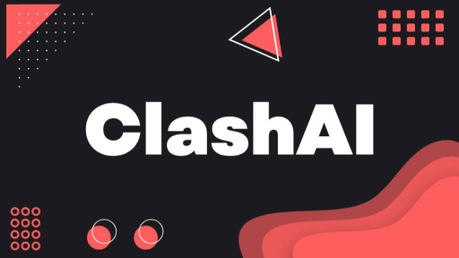

Welcome to **ClashAI** — your all-in-one gateway to the most advanced AI models on the market. We simplify your workflow by providing a **single unified API** that connects you to multiple AI services, eliminating the need to manage different SDKs or endpoints.

## Here's why developers choose ClashAI

<Card title='Unified Access' icon='layer-group'>
	We offer a variety of AI models through a single API. This includes models
	from OpenAI, Anthropic, and DeepSeek, covering language, vision, and more.
</Card>

<Card title='Cost Efficiency' icon='piggy-bank'>
	You'll save about 40% compared to other providers. This helps cut your costs.
</Card>

<Card title='Developer Friendly' icon='Code'>
	The documentation provides clear examples and instructions. It's easy to find
	what you need and get it working.
</Card>

<Card title='Robust and Scalable' icon='Server'>
	ClashAI is built to be reliable. It handles high volumes and has minimal
	downtime.
</Card>

## Getting Started

To start, sign up and get your API key. Check out the [Quickstart guide](/quickstart) to make your first request in minutes.
